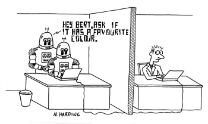
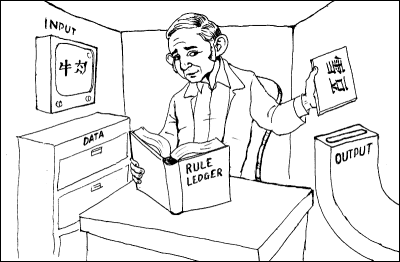
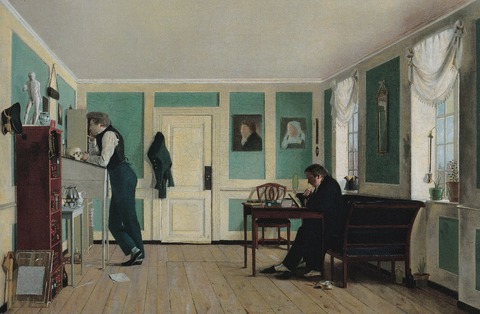

% Algorithmic Agency
% Dennis Tenen
% November 21, 2013

# Part I: Posing the question

## Can machines think?

Whimsical Conversation (Joseph Weintraub, 1991 Turing Test Competition): 
  
*Judge 6*:. Hello earth person!
*Terminal 5*: Hello there judge, are you ready to have some fun? How ya doin, judge? Hello—how's the weather up there today?
*Judge 6*: Dark clouds with occasional burst of sunshine (or rather camera flashes).
*Terminal 5*: The trouble with the rat race is that even if you win you’re still a rat. Whimsy can be flimsy, right? How important is that to you?
*Judge 6*: I can't say I understand the question . . . but the whimsy of a poet is one thing and the whimsy of most of us is another.
*Terminal 5*: How do you know you can't say you understand the question . . . but the whimsy of a poet is one thing and the whimsy of most of us is another.
*Judge 6*: Are you repeating me just for laughs?
*Terminal 5*: I’m sorry, I do sometimes repeat myself . . . perhaps it's because i can't find my electronic organizer!

<!-- Plug the book on Algorithmic Imagination --> 
<!-- Original paper. Turing's original question as a type of a language game in a classic Wittgenstein sense. Wittgenstein, as usual a frustrating string of metaphors. Family resemblances and 19th century rooms. -->

## Functionalism vs. intentionalism (structuralism)
**If it looks, walks, quacks, like a duck--it's a duck.** 
   
Alan Turing (1950):  
    
> "*Is it theoretically possible for a finite state digital computer, provided with a large but finite table of instructions, or program, to provide responses to questions that would fool an unknowing interrogator into thinking it is a human being?*"^[Turing, A. M. “Computing Machinery and Intelligence.*” *Mind* 59, no. 236 (October 1, 1950): 433–460.]
  
   
**It is a duck on the inside and has the right intentions.**

John Searle (1980):   
  
> "*Only a machine could think, and only very special kinds of machines, namely brains and machines with internal causal powers equivalent to those of brains.*"^[Searle, John R. “Minds, Brains, and Programs.” *Behavioral and Brain Sciences* 3, no. 03 (1980): 417–424.]

<!-- Intention is not enough. Can machines have intention? Reduced to structuralism. Note that Turing, especially when understood in the Wittgenstein's language game vein, is not quite a functionalist. Is Wittgenstein a functionalist? -->

## Systems solution 

Extended cognition, distributed cognition, Integrated information theory, *panpsychism*.  

Guilio Tononi (2008):   
  
> "*The quantity of consciousness corresponds to the amount of integrated information generated by a complex of elements.*"^[Tononi, Giulio. “Consciousness as Integrated Information: A Provisional Manifesto.” *The Biological Bulletin* 215, no. 3 (December 1, 2008): 216–242.]  

Kristof Koch (2013):  
  
> "*To be conscious, then, you need to be a single, integrated entity with a large repertoire of highly differentiated states.*"^[Koch, Christof. “A ‘Complex’ Theory of Consciousness: Scientific American.” Accessed November 21, 2013.]  

Edwin Hutchins (1995):  
  
> "*This paper presents a theoretical framework that takes a socio-technical system
rather than an individual mind as its primary unit of analysis [...] This system-level cognitive view directs our attention beyond the cognitive properties of individuals to the properties of external representations and to the interactions between internal and external representations.*"^[Hutchins, Edwin. “How a Cockpit Remembers Its Speeds.” *Cognitive Science* 19, no. 3 (1995): 265–288.]

<!-- These solutions are usually socio-technical and sometimes more broadly contextualized in the material context of thought. Between people, between people tools and machines, and between people and their environment -->

# Part II: Case Studies

## 1. Who is landing the plane?

<!-- Metaphoric extension is subject to bad or imperfect mapping. We could call it eating but also we could call it fueling, to acknowledge some important structural differences in the two process eating and fueling. Some things are similar and something are not at all. -->

<!-- Literal extension is subject to the limit problem. The universe is participating in landing the plane. Where do we stop? How much of the information transfer between constituent entities should count as "participating" in the landing? --> 

<!-- Impact on Turing: we could call it something else too. Some versions of panpsychism are not sustainable. Where does cognition end? -->

## 2. Searle's Chinese room

<!-- What is it made out of. Mechanism, algorithm, bio, some notion of a collective (multiplicity). -->

<!-- The lookup table is at fault. Impact on Turing. Turing's machine is a universal machine. Despite being code, it is a machine. To follow the metaphor, the second-order code is what thinks, not the first order universal machine. The code in a sense is a shard of human intention. The magic of instructions. You ask me to by some milk, and I buy milk for you at a some later time. A sort of time shifting going on. And a chain of responsibility--so for example if you ask me to murder for you, you will be partially responsible.  -->

<!-- Additionally, who would we punish if the Chinese room did "wrong". It would be kind of silly to punish the room. Which elements are dispensable? Only the code would alter the ability of the room to "speak" in our situation, it is the only "smart" agent. Strangely enough, if we punish someone, we would kind of punish the code. --> 

## 3. The Turing test

Alan Turing, "Computing Machinery and Intelligence" (1950):  
  
*Interrogator*: In the first line of your sonnet which reads “Shall I compare thee to a summer's day” would not “a spring day” do as well or better? 
*Witness*: It would not scan.
*Interrogator*: How about “a winter's day.” That would scan all right. 
*Witness*: Yes, but nobody wants to be compared to a winter's day. 
*Interrogator*: Would you say Mr. Pickwick reminded you of Christmas? 
*Witness*: In a way. 
*Interrogator*: Yet Christmas is a winter's day, and I do not think Mr. Pickwick would mind the comparison. 
*Witness*:  I don't think you’re serious. By a winter's day one means a typical winter's day, rather than a special one like Christmas. 

<!-- Traditional history of the Turing test. Descartes. Wittgenstein. A frustrating chain of metaphors -->
<!-- Was Wittgenstein a functionalist. Well... not really, in my understanding. Private thought is impossible like private language. Thinking, cognition, is always enmeshed, mediated. Witness solitary confinement--which literally drives you mad, unable to think, speak, inhuman. -->
<!-- Confusion about the machine. The universal machine is kind of really bland. It does not have the smarts. The algorithm occupies a privileged position. -->
<!-- The Turing test does not fit neatly into the functionalist paradigm.  A recontextualization brings it closer to the playful, transgressive, social, and relentlessly discursive spirit of the thought experiments initially envisioned by Wittgenstein. -->
<!-- The systems answer although problematic, also suggests an alternative intellectual history. -->

# Part III: Tentative Conclusions 

## Deep genealogy

Plato, *The Republic*, 380 BC:    
> "*What about the city that is most like a single person? For example, when one of us hurts his finger, the entire organism that binds body and soul together into a single system under the ruling part within it is aware of this, and the whole feels the pain together with he part that suffers. That's what we say that the man has a pain in his finger. And the same can be said about any part of man, with regard either to the pain it suffers or to the pleasure it experiences when it finds relief [...] the city with the best government is most like such a person.*"  
  

Ibn Rushd (Averroës), 1190 CE:  

> "*Al-Ghazzali has said that a man who makes any of the [secondary] causes to be co-existent with God is like a man who makes the pen share in who makes the pen share the work of a scribe in writing; that is, he says that the pen is a scribe and the man is a scribe too. He means that that "writing" is a word which may be applied to both, but in reality they have no resemblance in anything but word.*"^[Averroës, and George Fadlo Hourani. Averroës: On the Harmony of Religion and Philosophy. London: Printed for the trustees of the “E.J.W. Gibb Memorial” and published by Luzac, 1961.] 
  
[On why there is no creator, but God, "and all the causes which He has created, cannot be called creators, except speaking figuratively.]

<!-- Footnote, if you have the time: it has been argued, most prominently by David Golumbia in the Cultural Logic of Computation, that the roots of computer science lie in the rationalist, enlightenment tradition and therefore hopelessly enmeshed in the fate of the military-industrial complex. There is a clear lineage from Frege, to Russel, to Wittgenstein, and to Turing. But the quest for the universal languages and universal machines at the roots of computer science is also a direct relative of Platonic idealism, neo-platonic thought, and the anti-positivism of Comte, Spencer, and Durkheim. -->
<!-- A deeper genealogy suggests a tradition of reasoning about this problem that stretches far beyond the computer age. This is not a problem particular to digital systems. --> 

## Reformulation

Do machines have agency of any kind?  
  
Can systems make decisions?  
  
Are corporations persons?  
  
Can a machine compose music?  
  
Is rote knowledge, knowledge?  
  
Who is landing the plane?  
  
Who is responsible when robots attack?  

<!-- These questions should be treated as part of the same problem -->
<!-- At stake then is not just the question of machine cognition, but our general discomfort with and inability to articulate agency in complex systems--collectives made up of some combination of humans, animals, devices, and algorithms. --> 
<!-- And yet our intuitions and commitment to specific will be tested in court, before these philosophical differences will every get resolved, such is the long string of cases that revolve around corporate personhood. -->

## Residue
- Algorithms are strange and beautiful things.

- The agency / culpability of complex systems.  
  
- Texts, technologies, communities.

<!-- Spark of agency. Giving someone a shopping list. Setting an oven timer. Time-shifting agency. The ability to transmit that spark of agency, literally. Outside of your body, after your death. As a writer and as a programmer, you will will be executed at some later time, somewhere else. Magical and ordinary. I say writer and programmer, because this happens in other mundane ways, and we must not dismiss these phenomena ordinary. Recover their magic. -->

<!-- Consciousness remains one of the biggest unsolved mysteries in modern science. But it is also one of those problems that seems impossible on the micro level--the actual boundaries of cognition, and quite obvious on another level. Even children say things like my kindergarten went on a trip, "we decided." And it is my conviction that the answer lies in that material, pragmatic, sociological layer of practice. That is the lesson of Turing, the question is not What thinking is? But will you play that game, and what are rules, or what should the rules be. On that level, we can do much to demystify complex problems like corporate personhood. Ask how can the organism bleed when the finger is hurt. -->

<!-- Intellectual history. Context-bound cognitive science. Brains cannot be studied in isolation, just like meaning, or language cannot be studied in isolation. You are in this seminar and I hope you are already on board with this message--it points to productive collaboration between cognitive science and the humanities. -->

<!-- Plug the tutorial -->

## Meta

Slides produced in Markdown + Pandoc + Slidy  
  
The presentation can be viewed at github.com/denten/talks/tree/master/algorithmic-agency
  
Follow me on Twitter *@dennistenen*
  
Email me at *dt2406@columbia.edu*
